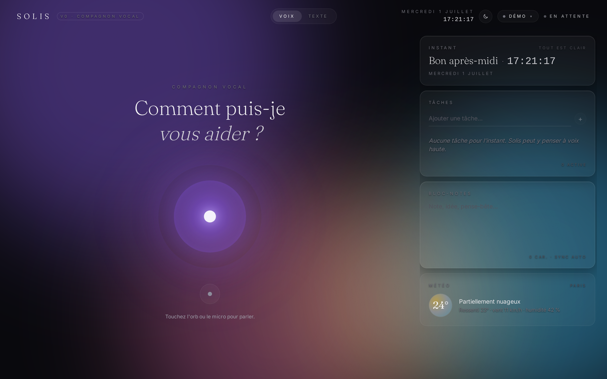

<div align="center">

# 🌅 Solis — Assistant vocal français

**Parlez, Solis écoute, réfléchit, répond. Tout dans le navigateur, sans tracking.**
> A French-first glassmorphic voice assistant that runs entirely in your browser.

[](LICENSE)
[](https://react.dev)
[](https://www.typescriptlang.org)
[](./.github/workflows/lighthouse.yml)
[](./.github/workflows/assets.yml)

[📸 Captures](docs/screenshots/) · [🚀 Démarrer en 30s](#-démarrer-en-30-secondes)

<picture>
  <source media="(prefers-color-scheme: dark)" srcset="docs/screenshots/hero-night.png">
  <source media="(prefers-color-scheme: light)" srcset="docs/screenshots/hero-day.png">
  
</picture>

<picture>
  
</picture>

</div>

---

## ✨ Ce que fait Solis

- 🎙️ **Voix native** — Web Speech API (`SpeechRecognition` + `speechSynthesis`). `fr-FR` par défaut, choisi depuis `navigator.language`. L'orb réagit en temps réel au micro via `AnalyserNode`.
- 🧠 **9 skills** — todo, notes, mémoire long-terme, recherche d'historique, browse, downloads, mailto, Discord, exécution JS sandbox dans un Worker dédié. Toggle ON/OFF par skill, persisté en `localStorage`.
- 🎨 **Glass aurore** — fond aurore 100 % CSS (`radial-gradient` + courbes de Lissajous), grain `<feTurbulence>` SVG inline, `backdrop-filter: blur(28px) saturate(1.3)`. Zéro asset externe.

## 🚀 Démarrer en 30 secondes

```bash
git clone https://github.com/DmzGamingYT/solis-assistant && cd solis-assistant
npm install
npm run dev
# → http://localhost:5173, autorise le micro, tape l'orb.
```

Pour brancher un vrai LLM : clique sur la pill **« Démo »** en haut à droite → choisis Groq / OpenRouter Zen / Ollama → colle ta clé (ou l'endpoint pour Ollama local). Le champ `model` accepte un override ; par défaut, chaque provider utilise son *tier gratuit*.

## 🛠️ Skills (function-calling OpenAI-compat)

Solis expose ses capacités au LLM sous forme de tools (canal `tool_calls` Groq / OpenRouter / Ollama). Toggle ON/OFF par skill, persisté en `localStorage` (`useSkills()`, clé `solis.skills.v1`).

| Skill          | Fait quoi                                                |
| -------------- | -------------------------------------------------------- |
| `tasks`        | Gère ta to-do (CRUD + `clear_done`)                      |
| `notes`        | Bloc-notes partagé (string unique, save auto)            |
| `remember`     | Mémoire long-terme clé/valeur (`facts`)                  |
| `searchHistory`| Retrouve une conversation passée, extraits horodatés     |
| `browseUrl`    | Fetch d'une page HTML → texte nettoyé                    |
| `downloads`    | Sauvegarde du texte en `.txt` côté client                |
| `mailto`       | Ouvre `mailto:` (to / subject / body)                    |
| `discord`      | Webhook Discord (message + embed)                        |
| `runJs`        | JS sandboxé dans un Worker dédié (`opaque-origin`)      |

> Source de vérité unique : [`src/ai/skills/registry.ts`](src/ai/skills/registry.ts). Chaque skill est un `SkillDefinition` `type: 'function'` OpenAI-compat.

## 🧱 Stack

**Core** — React 19.2 · TypeScript 5.9 strict · Vite 7 · Tailwind 4 (tokens CSS variables)
**Voix / audio** — Web Speech API · Web Audio API · `AnalyserNode` (10 fps EMA)
**LLM** — OpenAI-compat `/v1/chat/completions` SSE (Groq · OpenRouter Zen · Ollama ≥ 0.5)
**Persistance** — `localStorage` (transcript, tasks, notes, backend config, skill toggles)
**Shipping** — `vite-plugin-singlefile` → single-file bundle

## 🌐 Backends LLM

| Backend            | Where it runs | Cost         | Auth                                  | Notes                                       |
| ------------------ | ------------- | ------------ | ------------------------------------- | ------------------------------------------- |
| **Démo**           | local (echo)  | gratuit      | aucune                                | Default fallback; utile hors-ligne          |
| **Groq**           | cloud         | tier gratuit | clé API `gsk_…`                       | Llama 3.x · Mixtral · Gemma                  |
| **OpenRouter Zen** | cloud         | tier gratuit | clé API `sk-or-…`                     | Pool de modèles `…:free`                    |
| **Ollama**         | local         | gratuit      | endpoint (default `http://localhost:11434`) | Lance `ollama serve` côté machine    |

Le contrat `LLMProvider` (`src/ai/providers/`) fait abstraction ; `openaiCompatibleStream` est le parseur SSE partagé. Changer de backend au runtime = config flip — pas de re-mount, pas de tear-down, `AIManager` rebuild un nouveau provider au prochain burst de tokens.

## 🧭 Architecture

```
src/
├─ ai/         LLMProvider + 4 providers + 9 skills + speech + AIManager
├─ components/ aurora · glass · voice · chat · cards · panels · controls · layout
├─ hooks/      useVoice · useAssistant · useBackend · useMemory · useTasks · useSkills
└─ utils/      storage · time · cn
```

> Chaque fichier a une JSDoc qui explique son rôle et ses invariants. Le point névralgique est `useVoice.ts` (master conversation hook) et `AIManager` (`src/ai/manager.ts`) — `SOLIS_SYSTEM_PROMPT` y vit.

## 🎨 Design notes

- **Aurora** — quatre `radial-gradient` flous sur courbes de Lissajous, CSS pur (pas de canvas/WebGL pour le fond — préserve le GPU pour l'orb).
- **Grain** — `<feTurbulence>` SVG inline en `mix-blend-overlay` à 6 % ; pellicule analogique à coût zéro.
- **Glass** — `backdrop-filter: blur(28px) saturate(1.3)` + inset highlight + box-shadow. Trois variantes : `default`, `soft`, `heavy`.
- **VoiceOrb** — trois anneaux concentriques. L'anneau intérieur réagit au niveau micro via `AnalyserNode.getByteFrequencyData` lissé en EMA, poussé à 10 fps pour ne pas re-render React trop souvent. État exposé via `[data-orb-state]` pour les asserts Playwright.
- **Typo** — `Inter` pour l'UI, `Fraunces` pour les titres ; contraste graphique entre données et prose.

## 🤝 Contribuer

PRs bienvenues. Pour ajouter un skill : dépose un fichier dans `src/ai/skills/`, déclare-le dans [`SKILL_REGISTRY`](src/ai/skills/registry.ts). Chaque skill est exporté sous forme de `SkillDefinition` (OpenAI-compat `type: 'function'`).

À chaque push vers `main`, la CI typecheck, build, régénère les assets visuels et tourne Lighthouse.

## 📜 Licence & crédits

[MIT](LICENSE) — Polices Inter (OFL) et Fraunces (OFL) via Google Fonts. Aucun autre asset externe ; totale autonomie — animations 100 % CSS + SVG.
